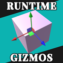

# Custom Unity Assets & Tools

> Custom made asset packages and tools for use with Unity

## Tools

- [**Runtime Gizmos**](Assets/RuntimeGizmos/README.md) 3D manipulation gizmos to emulate those found in the Unity Editor's scene view but accessible at runtime without the use of the editor APIs.

- [**Color Picker**](Assets/ColorPicker/README.md) A color picker usable at Runtime.

## Licence

_See [licence file](LICENSE) for more information_
